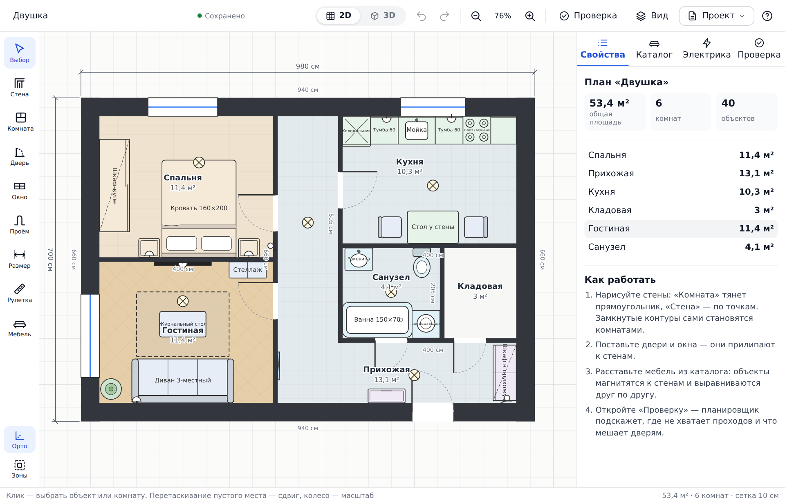
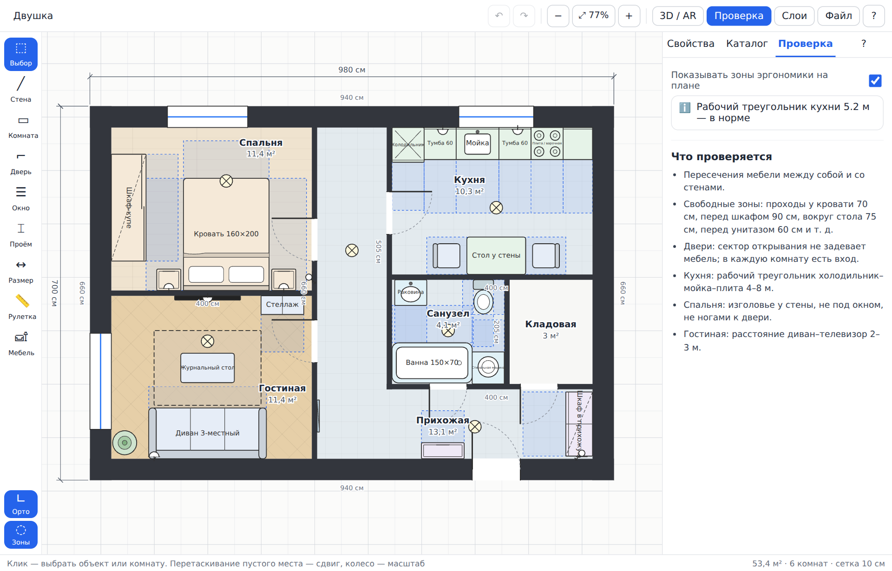
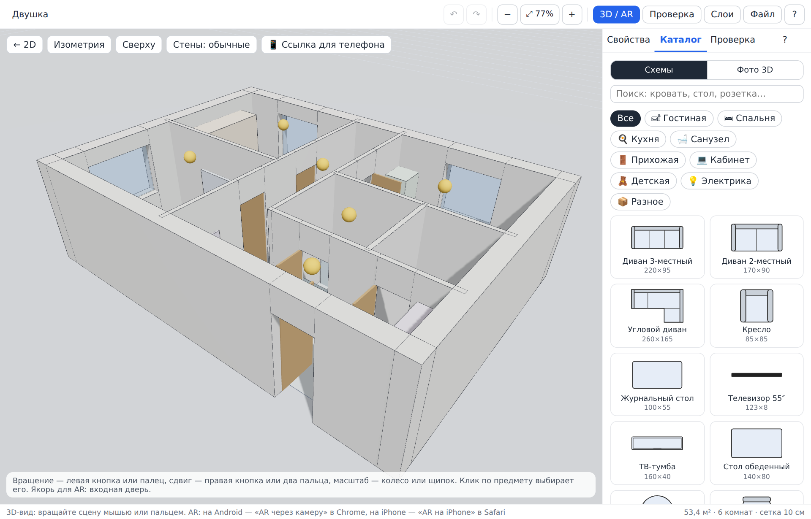
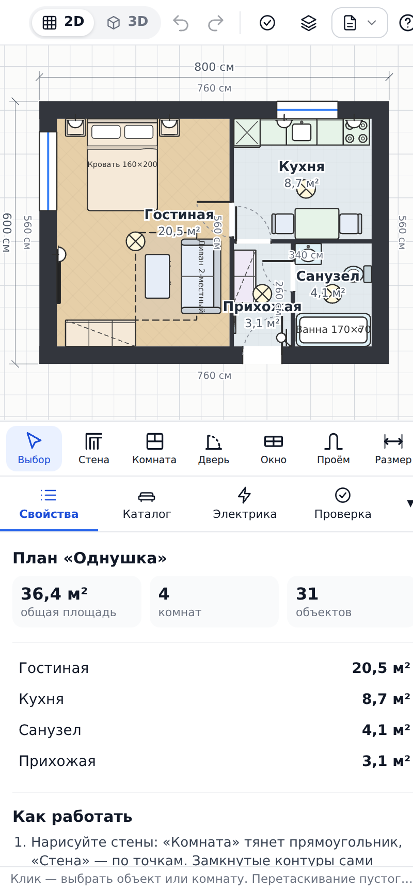
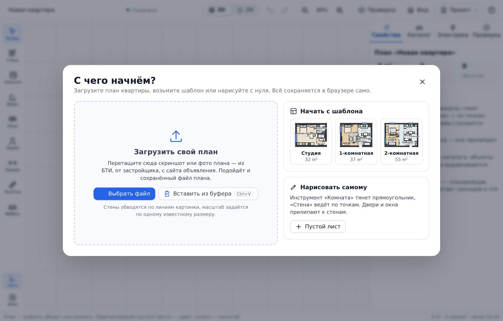

# Планировщик квартиры

Браузерный редактор планировки: начертите стены, расставьте мебель с реальными размерами, проверьте планировку по правилам дизайнеров, посмотрите её в 3D и наведите камеру телефона, чтобы увидеть расстановку прямо в квартире.

Работает без установки — в обычном браузере и внутри Telegram Mini App.

**Демо:** [igor123qwe.github.io/3d](https://igor123qwe.github.io/3d/) — откройте на телефоне, чтобы проверить AR.
Публикация включается один раз: Settings → Pages → Source: **GitHub Actions**. После этого каждый push в `main` обновляет демо.



## Что умеет

**Схема.** Стены рисуются по точкам или прямоугольником, с привязкой к концам стен, осям, Т-стыкам, сетке и углам 0/45/90°. Замкнутые контуры автоматически становятся комнатами: площадь считается по внутренним граням стен, как в техпаспорте. Двери, окна и проёмы прилипают к стенам, у дверей рисуется сектор открывания. У каждой стороны комнаты подписан её размер в чистоте — по внутренней грани, как на плане БТИ, а не по оси стены. Размерные линии, рулетка, слои, единицы см/мм/м.

**Своя схема картинкой.** «Файл» → «Загрузить схему картинкой…» кладёт скан БТИ или скрин объявления под чертёж. Масштаб задаётся кнопкой «Калибровать»: покажите на подложке отрезок с известным размером и введите его длину. Дальше стены можно обвести вручную с привязками или нажать «Распознать стены» — планировщик сам найдёт стены и дверные проёмы, а вы поправите результат.

**Каталог мебели.** Около 60 предметов с реальными размерами: спальня, гостиная, кухня, санузел, прихожая, кабинет, детская, электрика. Объекты магнитятся спинкой к стене, выравниваются друг по другу, поворачиваются ручкой и масштабируются.

**Проверка по правилам дизайнеров.** Планировщик сам находит ошибки: пересечения мебели и стен, нехватку проходов (70 см у кровати, 90 см перед шкафом, 75 см вокруг стола, 60 см перед унитазом), двери, задевающие мебель, комнаты без входа или окна, растянутый рабочий треугольник кухни, изголовье под окном, неудобное расстояние от дивана до телевизора. Клик по замечанию центрирует проблемный объект.



**Фотореалистичный режим.** Вкладка «Фото 3D» подключает каталог [Poly Haven](https://polyhaven.com) (лицензия CC0): модели с фотореалистичными превью, размерами и автоматическим подбором типа. Такие предметы показываются на плане рендером вида сверху, а не условным значком. Любому предмету можно назначить свою модель по ссылке на GLB.

**Товар из магазина по ссылке.** Вкладка «Каталог» → «По ссылке»: вставьте адрес товара, и планировщик прочитает название, фото, цену и габариты со страницы, подберёт тип предмета по названию и поставит его в план в настоящем размере. Любое поле правится вручную, а карточка товара с ценой и ссылкой остаётся в свойствах предмета.

**Электрика и умный дом.** Вкладка «⚡» раскладывает точки по правилам электрика: по две розетки с каждой стороны изголовья кровати, розетки у дивана, над кухонной столешницей и у техники, выключатели у дверей со стороны ручки, свет по комнатам, второй источник в комнатах больше 18 м². В санузле розетки ставятся только для техники. Умный дом добавляет умные выключатели, мастер-сценарии «ухожу» и «ночь», электрокарнизы на окна, датчики движения и протечки, термостаты тёплого пола и щит. Каждая точка помнит высоту установки и причину, по которой она здесь. Ведомость считает приборы по видам и комнатам и оценивает длину кабеля и число групп в щите.

**3D и AR.** Кнопка «3D / AR» строит объёмную сцену: стены 2,7 м с проёмами, полотна дверей, окна, полы по комнатам, мебель моделями.

Мебель в 3D — не габаритные коробки: у кровати матрас, подушки и изножье, у дивана спинка, подлокотники, подушки и ножки, у кухни мойка со смесителем и четыре конфорки, у шкафа ручки и цоколь. Модели строятся из габаритов предмета прямо в браузере, поэтому ничего не загружается и предмет всегда точно вписан в своё место на плане.



На Android в Chrome работает AR через WebXR: встаньте в проёме входной двери лицом внутрь квартиры, наведите кольцо на порог и коснитесь экрана — план закрепится в масштабе 1:1, дальше поворот и сдвиг подстраиваются вручную. На iPhone расстановка выгружается в USDZ и открывается системным Quick Look. Из Telegram кнопка «Ссылка для телефона» открывает страницу во внешнем браузере: план зашит прямо в ссылку.

**Мобильная версия.** Пинч-зум, панель-шторка, инструменты в горизонтальной ленте.



## Как устроен интерфейс

Сделано по образцу Floorplanner, RoomSketcher и HomeByMe: планировщик не встречает пустым холстом с меню «Файл».

- **Стартовый экран «С чего начнём?»** — загрузить свой план, взять шаблон с настоящей миниатюрой, нарисовать с нуля или продолжить прошлый. Появляется при первом открытии и по «Проект» → «Новый…».
- **План можно загрузить как угодно**: перетащить картинку или файл плана в любое место окна, вставить скриншот по Ctrl+V, выбрать файл. Путь один, приёмник общий — картинка начинает новый проект (чистый лист, схема подложкой), JSON открывается как план. Имя проекта берётся из имени файла.
- **Своя работа не пропадёт молча.** На чистом листе и нетронутом шаблоне схема просто заменяет план. Если в проекте уже есть свои стены и мебель, планировщик спросит: начать новый проект по схеме или подложить её под текущий план (для обводки заново). Прежний план в любом случае вернёт Ctrl+Z. Заменить картинку под уже обведёнными стенами можно в панели подложки — «Заменить картинку».
- **Подложка ведёт по шагам**: 1) получить стены — с ИИ или обводкой линий, 2) проверить масштаб, 3) убрать подложку. Тонкие настройки обводки спрятаны, пока не нужны.
- **Шапка**: имя проекта, индикатор автосохранения, переключатель 2D | 3D по центру, отмена и повтор, зум, «Проверка» со счётчиком. Меню «Проект» — новый, загрузить, открыть, сохранить (Ctrl+S, Ctrl+O), экспорт, ссылка для телефона. Меню «Вид» — слои, единицы, шаг сетки: настройки отдельно от файлов.
- **Пустой лист** не молчит: по центру холста три действия — загрузить план, шаблон, нарисовать комнату.
- Все иконки векторные, в одном стиле; шрифт Inter с системным запасом.



## ИИ: по модели на задачу

Приложение работает и без ИИ. Если подключить — три вещи становятся заметно лучше.

**Распознавание плана — чертёж заново по числам.** Обводка линий видит только пиксели: на фото плана БТИ она принимает выноски за стены и не знает масштаба. Модель со зрением координаты тоже называет приблизительно, зато числа читает надёжно: размеры у стен («3.72»), площади в комнатах («13.9»), двери и окна. Поэтому чертёж строится не по линиям, а с нуля по числам (`reconstruct.ts`):

1. Каждая комната — прямоугольник с подписанными размерами; площадь сверяет и поправляет, если подпись у стены была частичной.
2. Грани соседних комнат сводятся в общие оси стен, а оси подгоняются методом наименьших квадратов под размеры. Где числа не сходятся — грань перевешивается на другую ось или получает свою (уступ стены в 30 см не слипается с соседом).
3. Между двумя комнатами — перегородка 10 см, с одной стороны — наружная стена 40 см. Комнаты находятся по контуру, их площади сверяются с подписанными, и в диалоге «Распознано» видно, на сколько процентов сошлось и где не сошлось.

Геометрия — с картинки, смысл — от модели. Сначала картинка сегментируется сама: по очищенному растру находятся все замкнутые области — комнаты по внутренним граням стен (`segmentRooms`, та же заливка, что «комната по клику», только для всех свободных пикселей разом; дверные проёмы закрыты расстоянием до линий). Модель к этим областям только подписывает: имя и площадь садятся на область по точке модели, а где точка промахнулась — по площадям: у верных пар отношение подписанной площади к площади области одно и то же (квадрат масштаба), и оно же даёт масштаб. Подпись, которой не нашлось области, — выдуманная комната, она отпадает. Соседство и наружные стороны берутся с областей, так что общие стены — одни на двоих по построению. Кнопка **«Комнаты с картинки»** делает то же без ИИ: комнаты по номерам, масштаб задать по отрезку или по площади.

**Комнаты ищутся по стеновым линиям, а не по всей графике.** На снимке экрана рядом с планом бывает панель приложения, подписи и таблицы — по ним сегментация находила «комнаты» на полях, а масштаб считался по чужим линиям. Теперь картинка сначала чистится по толщине штриха: сплошные пятна (панели, плашки, чёрные поля) удаляются целиком, волоски в одну точку — тоже, остаются линии от двух точек до сороковой части кадра. Комнаты ищутся и по чистым линиям, и по всей графике, берётся тот вариант, где комнат нашлось больше: стеновые линии бывают прерывистыми, и тогда выручает прежний путь.

Что в сегментации сделано против типичных бед фотографий (`raster.ts`): радиус закрытия проёмов подбирается **голосованием по пяти радиусам** — настоящая комната находится почти при любом, случайная область (цифры на полях, миниатюра в углу скрина) при одном; поле листа вокруг плана **срезается полосами** вдоль краёв, пока не останется комната, подтёкшая в него через обрезанный край фото; полоса вдоль края листа (за рамкой скана, колонка лоджии со штриховкой) комнатой не считается. **Штриховка — не комната**: вентшахту, кладку и колонны на плане БТИ рисуют рядами мелких квадратиков, очистка их стирает, и полоса выглядела пустой узкой комнатой. Теперь плотность меток внутри области считается по исходной картинке: в комнате — подпись и пара цифр (1–3 % точек), в штриховке — каждая десятая точка; узкая или вытянутая полоса с такой плотностью комнатой не становится, и отчёт об этом говорит. Мелкие обрывки свободного места (карман за выноской размера, угол за рамкой окна) при дорастании комнат до стен не мешают — их место достаётся комнате. **Цифры у стен — не стена**: размер «1.80», прилипший к линии стены, раньше выедал из узкого санузла полосу в строку текста (2,41 м вместо 2,58). Высота надписей меряется по отдельно стоящим знакам, и из стеновых линий уходят штрихи не длиннее строки мелкого текста — длинная стена остаётся, цифра нет.

**Комната — многоугольник по пикселям, а не прямоугольник** (`picture.ts`). Так делают открытые проекты и советуют на форумах по OpenCV: заливка → контур → прямые углы. Область заливки держится на радиус закрытия от стен, поэтому сначала она **дорастает до граней стен** — все комнаты растут разом, через бумагу, но не через чернила, и в дверном проёме соседи встречаются посередине. Потом область **обводится по пикселям** и **выпрямляется**: ступеньки мельче шестой части радиуса (≈ 7 см) — дрожание линии, выступ наружу, вернувшийся на ту же линию, — язычок в проёме или нише окна. **Закутки не теряются**: в нишу уже двух радиусов (закуток 0,27 × 0,73 у балкона) рост не дотягивается, и свободный кусок бумаги, окружённый стенами и одной комнатой, достаётся ей, если выходит к ней широкой стороной; кусок, что касается двух комнат, поля или края листа, — проём или улица. Отдельно стоящая цифра в закутке («0,73») нишу на щели не делит — подпись касается стены разве что одним боком, а сторона квадратика штриховки перекинута между двумя стенами и остаётся преградой. Вырез в контуре, где нет ни стеновой линии, ни чужой комнаты, закрывается: колонна нарисована линией, цифра — нет. **Результат не зависит от размера файла.** Один и тот же план, снятый с экрана при масштабе Windows 100 % и 150–200 %, раньше распознавался по-разному: на крупном кадре цифры по 25 точек в высоту, и штрих цифры, упёртый в стену, вместе с её толщиной набирал длину стены — закуток у балкона перегораживался, а черты дверей расплывались шире допуска. Теперь картинку, где мелкие цифры выше 16 точек, разбираем уменьшенной копией (цифры ≈ 13 точек); комнаты, стены и проёмы из неё встают на ту же подложку в тех же сантиметрах, а модель читает подписи по фрагментам исходного фото. Из стеновых линий уходят отростки — короткий штрих, упёртый в стену одним концом; перемычка, что держится за стены обоими концами (стенка закутка, сторона квадратика), остаётся. Черта двери меряется по ядру у пика, без ореола размытия. Косой прогон считается стеной, только если он тонкий: у жирной цифры, прижатой к стене, косых хорд длиной в стену полно, но поперёк такой хорды — всё пятно цифры. Вентшахтой считается полоса не шире трети обычной комнаты или вытянутая: санузел 1,80 м шириной на фото с фоновой сеткой по плотности точек не отличался от штриховки и пропадал. В наборе для проверки — тот же план в 1,25 и 2 раза крупнее.

**Снимок под углом выпрямляется сам** (`raster.ts: perspectiveQuad`, `rectify.ts`). Стены плана идут в двух перпендикулярных направлениях; на фото, снятом под углом, прямые каждого направления сходятся в свою точку схода. На плане пользователя верхняя стена поднималась к правому краю на 9 точек, а нижняя шла ровно: каждая комната видела верхнюю стену на своей высоте, и чертёж строился «ёлочкой» — верх коридора у выреза 5ж оказывался на 7 см выше низа санузла, хотя это одна прямая, а комнаты справа выходили на 3 % шире. Теперь по прямым стен находятся обе точки схода, и если углы плана сдвинулись бы больше чем на полторы точки, картинка выпрямляется так же, как «По 4 углам», только углы находятся сами. Разбор при этом идёт по исходному снимку: пересчёт картинки размывает тонкие черты дверей и короба в стенах (проверено — правок в наборе было бы 19 вместо 8). Выпрямляется готовый чертёж: концы стен переводятся тем же преобразованием, стены ложатся строго по осям, почти соосные (ближе 6 см) сводятся на одну прямую, Т-стыки остаются стыками. Подложка показывается выпрямленной, чертёж лежит на ней. На всех планах набора без всякой подгонки размеры комнат расходятся с подписями на 4–12 см (было 10–13), формы совпадают на 97–99 %.

**Размеры — как в подписях плана** (`fitlabels.ts`). Чертёж БТИ нарисован от руки не точно в масштабе, а снимок добавляет перспективу и изгиб объектива: если поделить подпись на размер комнаты в точках, у каждой комнаты выходит свой масштаб. Поэтому одна картинка без подписей даёт 4–12 см мимо на каждой комнате — так делают и сервисы «загрузи план, задай масштаб по одному отрезку». Подпись — обмер, картинка — эскиз: форма берётся с картинки, числа — с подписей. Так же устроены разборы планов с распознаванием подписей: сначала стены, потом числа, потом правка чертежа под реальный масштаб. Модель читает не только ширину и глубину комнаты, но и **все размеры вдоль стен** — 0,26, 0,68, 1,29, стороны коридора (`walls`: сторона, место вдоль неё, сантиметры). Каждая подпись ищет свою грань контура: на нужной стороне, похожую по длине (±10 %, не меньше 8 см); сначала сходятся самые уверенные пары, одна грань — одна подпись, так 0,64 выступа не забирает грань закутка 0,73. Потом по каждой оси решается одна задача наименьших квадратов: узлы — **грани стен**, а не оси, и толщина стены — тоже отрезок. Если подписи требуют («4,08 = 2,58 + стена + 1,37»), стена становится тоньше нарисованной — до половины, не меньше; отрезок не выворачивается, а ступенька в 10–12 см между верхом соседних комнат, которой на плане нет, сходится в ноль. Концы стен после подгонки встают на те же оси, стыки остаются общими, и если какая-то комната всё же разомкнулась бы, подгонка не применяется. Подпись, что расходится с картинкой больше 6 %, — ошибка чтения или размер части Г-образной комнаты: её не тянем. Подгонка идёт по умолчанию, после выпрямления; «Заменить, размеры как на картинке» оставляет чертёж без неё. На всех 10 снимках набора размеры подписанных комнат сходятся с подписями до 0–1 см (без подгонки — 3–10 см).

**Стена — одна прямая** (`rectify.ts: evenWalls`). Кусок стены у каждой комнаты меряется по своему месту на снимке, и на фото стена ещё и чуть изогнута объективом: над 5ж наружная стена той же толщины встаёт на 10 см ниже, чем над санузлом, — снаружи «лесенка», которой на плане нет; стена над коридором под вырезом 5ж выходит 11 см, под санузлом 13, и верх коридора распадается на две грани, 67 и 205, вместо одной 2,77 — подпись её не находит. Соседние соосные куски сводятся в одну стену с общими гранями: перегородка — если обе грани расходятся не больше 3 см; наружная стена — если кусок вдоль целой комнаты (оба куска длиннее 1,5 м) съехал целиком (толщина та же, сдвиг не больше 16 см и 0,4 толщины), если толщину намерило по-разному (внутренние грани совпали, наружные ближе 16 см) или если это короткий кусок у угла (до 40 см), что вобрал толщину поперечной стены и вышел заметно толще соседа: низ ниши 0,68 выходил двумя ступеньками 37 + 33. Настоящий уступ меняет одну внутреннюю грань или сдвинут на коротком куске той же толщины — выступ 0,64 × 0,13 на кухне, ниша 1,29 × 0,68, закуток 0,27 × 0,73 — и остаётся; в наборе это проверяется числом углов кухни (не меньше 10), потому что по площади выступ почти не виден (0,08 м²). Перемычка, сошедшаяся в точку, убирается. После подгонки сводятся только куски, чьи грани у комнат уже совпали до сантиметра, чтобы не сбить размеры.

**Край кадра — не стена.** Если план обрезан по наружной стене, в крайнем столбце снимка — полоска её чернил или тёмный край фото во всю высоту. Выносная черта размера «1,29» в нише у входа упиралась в эту полоску, переставала считаться отдельной короткой чертой и делила нишу пополам: ниша выходила 103 × 38 лесенкой вместо 1,29 × 0,68. Теперь, решая, стоит ли черта особняком, рамку в одну точку по краю кадра не учитываем; сама полоска остаётся и замыкает нишу у края. В наборе — тот же план, обрезанный ровно по краю (bti-dvushka-edge).

**Выносная черта размера — не стена.** У размера «1,29» от стены внутрь ниши идёт тонкая черта: одним концом держится за стену, другой висит в воздухе, а вдоль неё стоит число. На крупном снимке она длиннее порога отростков, оставалась стеной и делила нишу у входа: ниша выходила 52 + 69 × 38 лесенкой. Теперь такая черта убирается, если она одиночная (у стены, нарисованной двумя линиями, рядом есть параллельный близнец), не длиннее 2,5 высоты цифр, вокруг её кончика пусто и вдоль неё стоят штрихи числа. Стенка уступа 0,26, чей угол съели цифры «0,26», не трогается: рядом с её концом стенка 0,38.

**Ступенька в углу от цифр.** Цифры «0,68», лежащие на нижней стене ниши, не пускают рост области в угол, и в контуре остаётся ступенька: у пользователя низ ниши выходил двумя уровнями, 1,03 и 1,29. Площадка такой ступеньки сдвигается до соседней стороны, если в углу нет прямой стеновой линии во всю площадку или во весь подступенок у самого поворота. Цифры, даже слипшиеся со стеной и попавшие в стеновые чернила, — пятна, а не линия; настоящий уступ (0,26 × 0,38) ограничен стеновой линией и остаётся.

**Чего модель не прочитала — переспросить и показать.** Подписи комнат читает сначала дешёвая модель, и от раза к разу она пропускает размеры: у 4ж и кухни на плане пользователя не легли ни ширина, ни глубина (400 × 415 вместо 4,01 × 4,26), а размеров вдоль стен (2,77, 1,29, 0,38) не было вовсе — коридор, ниша и уступ остались как на картинке. Теперь комната без ширины и глубины и комната с нишами без размеров вдоль стен переспрашиваются у следующей модели в цепочке (она заточена под чтение документов), и недостающее берётся у неё. В окне «Распознано» — строка о размерах вдоль стен: сколько прочитано и какие не нашли своей стены.

**Размеры по одному: лист вырезок.** Даже переспрос не спасал: у пользователя модель возвращала крупные цифры (площади, 3,72, 4,08), а мелкие размеры у стен — нет, и ниша выходила 103 × 38, коридор 281, уступ 46, комнаты 418 вместо 4,26. Проверка на неполных ответах это подтвердила: без размеров вдоль стен тот же код даёт ровно такой чертёж. Модель просили сразу две вещи — прочитать число и сказать, у какой стены и где вдоль неё оно стоит, — и ошибалась в обеих. Теперь место числа берётся с картинки. Подписи находятся по всем меткам (`raster.ts: labelBoxes`): всё, что не прямая стеновая линия, чуть утолщается, и пятно высотой в строку и длиной в два–шесть знаков — подпись; строка боком выше, чем шире; номер над площадью (пятно в две строки) и ряд квадратиков штриховки подписью не считаются; две подписи впритык («0,64» боком над «0,13») разбираются ещё раз мельче. Каждая подпись вырезается из исходного фото, увеличивается до крупной строки и кладётся на один лист с красным номером клетки (`ai.ts: numberSheet`); подпись боком — в двух поворотах, одна из них прямая. Модель только переписывает, что в каждой клетке; площадь «13,9», номер «5ж» и штриховка отсеиваются по виду числа (`sizeFromText`). Прочитанное число встаёт к ближайшей параллельной грани комнаты, в которой стоит, если длина сходится (`fitlabels.ts: placeLabels`); число во всю сторону заменяет ширину или глубину от модели. Лист, который дешёвая модель вернула почти пустым (чисел меньше четверти клеток), уходит следующей модели: неполный ответ для цепочки не ошибка, но и не ответ. В окне «Распознано» — строка «Размеры по одному»: сколько подписей нашлось, сколько прочитано числами, сколько легло на стены и какая модель читала. В наборе — план пользователя, где модель прочитала только крупные цифры, а лист «читается» по эталону (bti-dvushka-user-poor): без листа у него 7 правок (грани 137, 242, 270, 234 и ширина 4ж), с листом размеры сходятся до сантиметра.

**Размер, которого модель не прочитала, — из площади.** Модель читает подписи по кускам плана, и от раза к разу может пропустить размер: у 4ж «4,26» написано посреди комнаты, а не у стены. У прямоугольной комнаты недостающий размер — площадь, делённая на другой: 17,1 / 4,01 = 4,26. Он берётся, только если сходится с картинкой до 3 %, и слабее прочитанного; у кухни с закутком площадь меньше рамки, и так считать нельзя.

**Ступенька не на месте — по подписям.** Если подпись стоит точно у своей грани (середина числа не дальше 8 % стороны), а длина разошлась до 20 %, — это уступ, распознанный не на месте: низ ниши прихожей выходил на 20 см выше, ниша 109 вместо 1,29, стена под ней 269 вместо 2,42. Обе подписи тянут одну грань в одну сторону, и она встаёт на место. Такие пары сходятся вторым заходом, после уверенных. С ними прихожая на всех 10 снимках набора — 511 × 408 и 11,4 м², на трёх снимках раньше ниша терялась и прихожая выходила 472–484 в ширину.

**Подписи у стен — не стена.** Жирные цифры, прижатые к стене («1,29» в нише прихожей), сливались с ней, и ниша 0,68 × 1,29 выходила вдвое ниже. По длине, толщине и форме штриха цифру от короткой стенки не отличить, зато подпись узнаётся целиком: несколько знаков цифрового размера рядом или слитая строка в высоту знака и длиной до четырёх. Такие подписи вынимаются из стеновых линий и не мешают закуткам; неприкосновенны прямые линии, что держатся за стены обоими концами (стенка закутка у балкона). Короткая тонкая черта, стоящая особняком (размерная линия), — тоже не стена: стена примыкает к стенам. Язычок области срезается, только если проходит сквозь стену (стена по обе стороны от основания): отсек ниши между выносными линиями размеров — не язычок. Г-образная прихожая, комната с вырезом под шахту, уступы стены — всё это получается само, без правил «кто кому уступил угол». Раньше Г-образная область резалась по ступеньке на «кухню» и «коридор», и на настоящем плане БТИ прихожая 11,4 м² распадалась на две комнаты; теперь область внутри плана не режется вовсе.

**Картинка — правда для геометрии, цифры — для масштаба и проверки.** Если комнаты нашлись на картинке, стены собираются из граней их контуров: где грань одной комнаты смотрит на грань соседки через полосу чернил, там перегородка ровно этой толщины и посередине; пустая полоса между двумя комнатами (шахта) — одна толстая стена, а не две с дырой; грань без соседа — наружная стена, толщина меряется по чернилам наружу, а не вышло — обычная. Короткий кусок грани мимо торца поперечной стены — продолжение перегородки, а не уступ наружной стены. Дверь «справа внизу» у Г-образной комнаты встаёт в ту грань, что лежит напротив, — в стену выреза, а не в пустоту рамки. Прочитанные цифры стены не двигают. Раньше решатель подгонял оси под подписи, и одна неверно прочитанная цифра уводила комнату за край фото и рождала щели-«кладовые». Решатель по числам остался для плохих фото, где комнат с картинки не нашлось.

**Двери и окна — по самой картинке.** Модель со зрением проёмы на плане БТИ находит через раз: то пропустит все окна, то поставит дверь в наружную стену. А нарисованы они однозначно. Дверь — в стене между двумя комнатами: либо разрыв (поперёк стены нет ни точки), либо участок стены, закрытый с концов тонкими поперечными чертами на ширину двери, 55–130 см; черта должна резко выделяться над обычной стеной, а черты у Т-стыков стоят парой на толщину стены и дверью не считаются. Окно — в наружной стене из двух линий: внутри идут линии стекла во всю длину окна, а с концов окно закрыто чертами через всю толщину стены; штриховка квадратиками и вентканал внутри стены окном не становятся. От модели берётся только то, чего картинка не показала: входная дверь прихожей и окна в тех стенах, где по картинке окна нет. В отчёте видно, сколько найдено по картинке и сколько назвала модель.

**Масштаб — по согласию подписей, неверные цифры называются.** Каждая подпись — площадь, ширина, глубина — даёт свою оценку сантиметров в пикселе. Верные сходятся в одно число, неверно прочитанная выпадает. Масштаб берётся по той оценке, с которой согласно больше всего подписей, а выпавшие показываются в отчёте спорными: «6 ширина 384 см, по картинке 179 см». Спорные подписи один раз перечитываются моделью посильнее по тому же фрагменту — с указанием, в какую сторону не сошлось, но без правильного ответа, чтобы она не согласилась просто так.

**Подписи читаются по комнатам, а не по всему снимку сразу.** Комнаты уже найдены с картинки, поэтому модели они показываются по одной, крупно: увеличенный фрагмент исходного фото и один вопрос — номер, площадь, размеры у стен этой комнаты, её двери и окна. Всё за стенами комнаты на фрагменте закрашено: у Г-образной прихожей в рамку попадал санузел, и модель читала его номер. Номера фрагмента в подсказке нет — модель переписывала его в имя комнаты. Закрашены только сами соседние комнаты: стены, двери и окна, нарисованные снаружи стены, остаются видны, поля фрагмента — пять процентов кадра. Модель просят пройти по каждой из четырёх стен; дверь между комнатами обычно называют обе — она ставится один раз. Если одно имя всё же досталось двум комнатам, оно остаётся там, где сходится площадь. На штриховку или шахту модель может ответить «не помещение» — такая область из комнат уходит. На общем снимке мелкие цифры путаются («0.82» читается как «3.84», и весь масштаб уезжает), на фрагменте — нет. Вызовов получается по числу комнат, но это дешёвая модель и маленькие картинки; у мелких вызовов свой счётчик запросов, чтобы они не съедали квоту расстановки мебели. Если подписей набралось меньше половины, работает прежний путь — один проход по всему плану.

**Проверка по исходной картинке** (`quality.ts`). Процент совпадения площадей — не мера качества: он считает только комнаты с замкнутым контуром и молчит о потерянных. Поэтому проверяется каждая сторона отдельно, и в диалоге «Распознано» это видно по разделам: **полнота** — все ли помещения, что назвала модель, попали на чертёж, и почему нет; **стены** — какая доля их длины лежит на линиях картинки и на сколько сантиметров ушли остальные; **формы** — совпадает ли контур каждой комнаты с областью на картинке (так видно потерянный выступ); **размеры** — на сколько сантиметров расходится каждая прочитанная цепочка с расстоянием между стенами; **проёмы** — сколько встало из названных; **площади** — дополнительной проверкой. Пока полнота не подтверждена, результат не объявляется точным, и вторая попытка с моделью посильнее запускается именно по этой оценке, а не по одним площадям.

**Комнату не выбрасывают молча.** Раньше ради сходимости площадей могло исчезнуть до двух комнат. Теперь выбросить можно только то, чего нет на картинке: область сегментации или заливка под рамкой модели — это подтверждение. Подтверждённая комната остаётся, а в отчёте она помечена сомнительной: «без неё площади соседей сошлись бы лучше, но на картинке она есть — уточните это место».

**Набор для проверки** (`bench/`, `npm run bench`). Несколько настоящих планов с эталоном, проверенным вручную, и метрики, которые считаются одинаково от прогона к прогону: пропуски комнат, лишние, площади и размеры в сантиметрах, совпадение форм, доля стен на линиях, проёмы и грубая оценка ручной доработки. Подписи берутся из эталона, так что измеряется геометрия, а не то, как модель прочитала цифры в этот раз. Это набор **для проверки, а не для обучения**: он показывает, стало ли хуже после правки кода, и на чём именно. Как добавить свой план — в `bench/README.md`.

**Уточнить участок.** Инструмент «Уточнить» (кнопка в левой панели и в шаге «Получить стены»): обведите спорное место на чертеже и скажите, что там — стена, проём без двери, дверь, окно или ничего. Правка коснётся только участка: стена внутри него обрезается ровно по границе (насквозь — разрезается надвое), проём встаёт шириной с участок, новая стена дотягивается до соседних, чтобы комната замкнулась. Вариант «Спросить ИИ» шлёт модели увеличенный кусок **исходного** фото с одним вопросом — мелкую деталь она читает надёжнее, когда та занимает весь кадр; ответ приходит с пояснением, применять или нет — решаете вы.

**Масштаб называет свои основания.** В диалоге перечислены подписи, по которым он посчитан (медиана), и предложено подтвердить его одним известным размером — отрезком или площадью комнаты.

**Очистка не лишает модель цифр.** «Очистить» и «Выровнять» держат исходное фото рядом с очищенным: стены ищутся по очищенному растру, а подписи модель читает по оригиналу.

Если сегментация не нашла комнат (линии стен прерываются), рамка каждой комнаты от модели привязывается к настоящим стенам на картинке: заливка от её центра по очищенному растру даёт прямоугольник по внутренним граням стен (то же, что «комната по клику», только клик ставит модель). Так общая стена двух комнат — одна и та же линия, а не две рамки, разошедшиеся на треть. Модель заодно называет соседей за каждой стеной и наружные стороны — по ним общие стены сводятся даже там, где рамки промахнулись. Если площади сходятся хуже 90 %, по одной убираются комнаты, без которых сходимость растёт (модель иногда выдумывает лишний санузел); если и тогда хуже 85 % — второй запрос идёт сразу к модели посильнее с подсказкой, что разошлось, и остаётся лучший ответ.

Масштаб ставится по всем числам разом (размерные цепочки и размеры комнат в одной медиане; привязанные к стенам рамки — в приоритете) — калибровать линейкой не нужно. Если модель не прочитала размеров комнат, чертёж собирается по стенам с картинки, как раньше, и масштаб подбирается по площадям; в диалоге об этом сказано прямо. Побеждает тот вариант, где замкнулось больше комнат.

**План по картинке — что взято у лидеров и что сделано лучше.** Разбор Planner 5D, RoomSketcher AI Convert, Coohom/Homestyler, Floorplanner, magicplan, Sweet Home 3D и Remplanner — в [docs/plan-from-image.md](docs/plan-from-image.md). Коротко: все просят «снимать строго сверху и вырезать лишнее в редакторе», масштаб задают одной известной длиной, а автоматика «читает все линии как стены». Здесь фото готовится на месте (**Выровнять**, **Выпрямить по 4 углам**, **Очистить**), есть **комната по клику** (заливка от точки внутри комнаты на картинке, дверные проёмы закрываются по расстоянию до линий), **магнит к линиям картинки** при ручной обводке и масштаб **по площади комнаты** — а с ИИ чертёж строится заново по числам.

**Товар по ссылке.** Страницу магазина забирает сервер, а не браузер, поэтому публичные читалки с их капризами больше не нужны. Сначала бесплатный разбор разметки schema.org и Open Graph; дешёвая модель включается, только если в разметке чего-то не хватает.

**Расстановка мебели.** «✨» рядом с комнатой расставит мебель по правилам эргономики и объяснит каждое место. Координаты модели приблизительные, поэтому каждый предмет проверяется геометрией: вылез за стену, перекрыл дверь, наехал на соседа — отброшен с причиной. В план попадает только проверенное.

### Деньги

Правило простое: **сначала бесплатная локальная эвристика, потом самая дешёвая подходящая модель, и только если она не справилась — та, что посильнее.**

Умолчания подобраны по действующему прайсу routerai.ru (₽ за 1 млн токенов, вход/выход):

| Задача | Цепочка от дешёвой к дорогой | Цена ₽/1М | Потолок ответа |
| --- | --- | --- | --- |
| **План с картинки** | `google/gemini-2.5-flash-lite` | 10,9 / 43,8 | 8000 |
| | `qwen/qwen3-vl-235b-a22b-instruct` — заточена под OCR и разбор документов | 21,9 / 96,3 | |
| | `anthropic/claude-sonnet-5` — если не справились обе | 218,9 / 1094,6 | |
| **Товар со страницы** | `deepseek/deepseek-v4-flash` | 4,5 / 9,0 | 700 |
| | `openai/gpt-5-nano` | 5,5 / 43,8 | |
| | `google/gemini-2.5-flash-lite` | 10,9 / 43,8 | |
| **Расстановка мебели** | `deepseek/deepseek-v4-flash` | 4,5 / 9,0 | 4000 |
| | `z-ai/glm-5.3-flash` | 9,0 / 30,1 | |
| | `openai/gpt-5-mini` | 27,4 / 218,9 | |
| **Тип предмета по названию** | `meta-llama/llama-3.1-8b-instruct` | 2,2 / 4,4 | 120 |
| | `mistralai/mistral-small-24b-instruct-2501` | 5,5 / 8,8 | |

Что это даёт на практике: распознать план — около **0,2–0,5 ₽**, прочитать товар по ссылке — около **0,02 ₽**, расставить мебель в комнате — около **0,02 ₽**. Дорогая модель включается только там, где дешёвая вернула мусор, а перед любым вызовом сначала пробуется бесплатная локальная эвристика.

Цепочки переопределяются переменными окружения (`AI_MODEL_PLAN` и т.д.). Чтобы подобрать самые дешёвые под свои задачи, есть скрипт:

```bash
npm run models              # все модели роутера, от дешёвых к дорогим
npm run models -- --vision  # только те, что читают картинки
npm run models -- --find gemini
```

Он показывает цену за миллион токенов на вход и выход, поддержку картинок, умеет ли модель отдавать строгий JSON и размер контекста, а в конце печатает готовые строки `AI_MODEL_*` для `.env`. Генераторы картинок, озвучка и эмбеддинги отфильтрованы — они нам не подходят. Ключ берёт из `.env` или из переменной окружения. То же самое из работающего приложения — `GET /api/ai?models=1`. Картинка плана перед отправкой уменьшается до 1600 px по длинной стороне: цифры размеров ещё читаются, а платить за лишние пиксели незачем. Стоимость каждого вызова роутер возвращает в рублях — она видна в «Справке», а `AI_DAILY_LIMIT_RUB` ставит дневной потолок.

### Подключение

1. Получить ключ на [routerai.ru](https://routerai.ru) — единый API к моделям OpenAI, Anthropic, Google, DeepSeek с оплатой в рублях и форматом запросов как у OpenAI.
2. В Vercel: Settings → Environment Variables → `ROUTERAI_API_KEY`. Больше ничего не нужно, серверные функции в `api/` подхватятся сами.
3. Локально: `cp .env.example .env`, убрать решётку перед `ROUTERAI_API_KEY` и вставить ключ. `npm run dev` (или `start.cmd` / `./start.sh`) поднимает и серверную часть — плагин `tools/vite-api.ts` читает `.env` так же, как Vercel читает переменные окружения.

Ключ лежит только на сервере. Браузер ходит на свой же `/api`, ключа не видит и передать его никуда не может. Адреса магазинов проверяются: запрос во внутреннюю сеть (`localhost`, `10.*`, `192.168.*`, `169.254.169.254`) не уйдёт. На каждый адрес действует ограничение частоты.

Если ключа нет, кнопки ИИ не показываются, а в панели подложки жёлтая плашка говорит, почему именно: файла `.env` нет, Блокнот сохранил его как `.env.txt` (запускалка переименует сама), решётка перед строкой не убрана, ключ не вставлен. Ключ, вписанный при работающем сервере, подхватывается без перезапуска — кнопка «Я добавил ключ — проверить» перечитывает `.env` на месте. BOM, CRLF и кавычки в файле не мешают. Распознавание без ключа работает по-старому: комната по клику и обводка линий.

## Запуск

**В один щелчок.** В репозитории лежат скрипты, которые сами обновляются из git, доставляют зависимости, если те поменялись, и поднимают приложение вместе с серверной частью:

| Система | Что запустить |
| --- | --- |
| Windows | двойной щелчок по `start.cmd` |
| Linux, macOS | `./start.sh` |

Браузер откроется сам. Если проекта рядом нет, скрипт сначала склонирует его — файл можно положить и в пустую папку. Повторный запуск не переустанавливает зависимости зря: только когда изменился `package-lock.json`.

Вся работа лежит в `tools/start.mjs`, а `start.cmd` и `start.sh` — короткие запускалки. Так сделано нарочно: `cmd`-файл с кириллицей и ветвлениями слишком легко ломается о кодировку и переводы строк, поэтому он держится в пределах ASCII, а всё остальное делает Node.

**Вручную:**

```bash
npm install
npm run dev        # http://localhost:5173
```

Остальные команды:

```bash
npm test           # тесты (vitest)
npm run typecheck  # проверка типов
npm run build      # сборка в dist/
npm run preview    # просмотр собранной версии
```

Деплой на Vercel работает без настройки: `vercel.json` уже в репозитории, страница `/planner` ведёт на приложение.

Публикация на GitHub Pages (`.github/workflows/pages.yml`) требует один раз включить Pages: Settings → Pages → Source: **GitHub Actions**. Путь размещения берётся из переменной `BASE_PATH`, поэтому приложение одинаково работает и в корне домена, и в подпапке.

## Как проверить

**На компьютере.** `npm install && npm run dev`, открыть `http://localhost:5173`. Проверить стоит по порядку:

1. **Своя схема.** На стартовом экране — «Загрузить свой план»: перетащите скриншот или фото плана в окно, нажмите «Выбрать файл» или вставьте из буфера по Ctrl+V. Откроется новый проект со схемой подложкой; панель справа поведёт по шагам: получить стены (с ИИ или обводкой линий), проверить масштаб, убрать подложку. С ключом ИИ нажмите «Распознать с ИИ»: диалог покажет, сколько стен и комнат, откуда масштаб и на сколько процентов сошлись площади с подписями на плане — только после этого чертёж заменяется. Вставьте вторую картинку поверх обведённых стен — планировщик спросит, новый это проект или подложка под текущий.
2. **Схема.** На стартовом экране выберите шаблон «2-комнатная» (он же «Проект» → «Новый…»): план, комнаты с площадями, двери с сектором открывания. Нарисуйте свою комнату инструментом «Комната», поставьте дверь и окно. Выберите стену и введите длину — соседние стены подстроятся.
3. **Проверка.** Вкладка «Проверка» и кнопка «Зоны» слева: подвиньте кровать вплотную к шкафу — появится замечание о проходе. Клик по замечанию центрирует объект.
4. **Фотокаталог.** Вкладка «Каталог» → «Фото 3D» → выберите предмет и поставьте на план: вместо значка появится вид сверху реальной модели. Требуется доступ к `api.polyhaven.com`.
5. **Товар по ссылке.** «Каталог» → «По ссылке», вставьте адрес товара из магазина, нажмите «Найти» и поставьте его в план.
5а. **С ИИ.** Если ключ подключён: первый шаг на подложке — «Распознать с ИИ»: прочитает план вместе с подписями и сам поставит масштаб, а «✨» рядом с комнатой расставит мебель и объяснит каждое место в свойствах предмета.
6. **Электрика.** Вкладка «⚡», включите «Умный дом» и остальные правила, нажмите «Расставить». Внизу появится ведомость с количеством приборов, высотами и оценкой кабеля.
7. **3D.** Переключатель «2D | 3D» в шапке: объёмная сцена, «Стены: прозрачные» открывает вид сверху, клик по предмету выбирает его. Приблизьтесь колесом — у мебели видны спинки, ножки, ручки и конфорки.

**На телефоне (AR).** Нужен адрес по HTTPS — с `localhost` камера в AR не запускается. Подойдёт любой вариант:

- GitHub Pages: включить один раз в Settings → Pages → Source: **GitHub Actions**, затем открыть `https://<владелец>.github.io/3d/`;
- Vercel: импортировать репозиторий, настройка не нужна.

Дальше: на Android в Chrome нажать «AR через камеру», встать в проёме входной двери лицом внутрь квартиры, навести кольцо на порог и коснуться экрана — план закрепится в натуральную величину. На iPhone в Safari — «AR на iPhone», расстановка откроется в системном просмотрщике. Из 3D-вида кнопка «Ссылка для телефона» копирует ссылку с планом внутри, чтобы перекинуть работу с компьютера.

**Автоматические тесты.** `npm test` — 105 проверок геометрии, поиска комнат, эргономики, операций над планом, истории правок и разбора плана из ссылки. `npm run typecheck` проверяет типы. То же самое выполняется в CI на каждый push.

## Как устроено

Точка входа — `src/main.tsx`. Весь планировщик лежит в `src/planner` и не зависит от остального приложения: его можно встроить в любой React-проект, отрендерив `<PlannerPage onBack={…} />`. Все размеры в модели данных хранятся в сантиметрах, углы в градусах.

| Файл | Назначение |
| --- | --- |
| `types.ts` | Модель данных: стены, проёмы, мебель, комнаты, размерные линии. |
| `geometry.ts` | Векторная математика, пересечения, площадь многоугольника, SAT-тест, внутренний офсет контура. |
| `rooms.ts` | Поиск замкнутых контуров стен (грани планарного графа) → комнаты с площадью по внутренним граням. |
| `snapping.ts` | Привязки: концы стен, оси, Т-стыки, орто-углы, сетка; магнит мебели к стенам и выравнивание объектов; посадка проёмов. |
| `catalog.ts` | Каталог мебели и электрики: размеры, высоты, зоны эргономики, подсказки дизайнера. |
| `checks.ts` | Проверки планировки и геометрия сектора открывания дверей. |
| `ops.ts` | Чистые операции над планом (добавить, сдвинуть, удалить). |
| `store.ts` | История изменений: undo/redo и режим предпросмотра для перетаскивания. |
| `Glyph.tsx` | Условные обозначения мебели в виде сверху. |
| `Scene.tsx` | Отрисовка плана в SVG. Используется и на экране, и для экспорта. |
| `PlannerCanvas.tsx` | Интерактивный холст: инструменты, перетаскивание, поворот, масштаб, пинч, клавиатура. |
| `PlannerPage.tsx` | Страница: инструменты, каталог, свойства, проверка, справка, файлы и экспорт. |
| `templates.ts` | Стартовые планировки: студия, однокомнатная, двухкомнатная. |
| `exporters.ts` | Сохранение и открытие JSON, экспорт PNG и SVG. |
| `polyhaven.ts` | Фотокаталог Poly Haven и ссылки на свои GLB. |
| `models.ts` | Загрузка glTF/GLB с кэшем и подменой путей текстур. |
| `topview.ts` | Рендер вида сверху модели для фотореалистичного плана. |
| `scene3d.ts` | Сборка 3D-сцены из плана и поиск входной двери для якоря AR. |
| `aicontract.ts` | Договор с моделью: что считается годным ответом. Всё, что не прошло проверку, отбрасывается. |
| `ai.ts` | Обращения к серверным функциям ИИ и уменьшение картинки перед отправкой. |
| `reconstruct.ts` | Чертёж с нуля по числам с плана, когда комнат с картинки не нашлось: комнаты-прямоугольники по подписанным размерам, оси стен подгоняются под числа, площади сверяются с подписанными. |
| `picture.ts` | Комнаты с картинки многоугольниками: дорастание областей до стен, обводка по пикселям, прямые углы без мелочи, стены из граней соседних комнат, точка двери на стороне Г-образной комнаты. |
| `planai.ts` | Распознанный план → чертёж: масштаб по подписям, выравнивание стен, сведение узлов. |
| `autolayout.ts` | Проверка расстановки геометрией: за стеной, в двери, на соседе — не ставим. |
| `api/_lib.ts` | Серверная часть: цепочка моделей от дешёвой к дорогой, учёт расходов, лимиты. |
| `tools/models.mjs` | Список моделей роутера с ценами и готовые строки для `.env`. |
| `StartDialog.tsx` | Стартовый экран: загрузить, шаблон с миниатюрой, с нуля, продолжить. |
| `AskDialog.tsx` | Вопрос с вариантами вместо `window.confirm`: заменить проект, подложить схему. |
| `intake.ts` | Приём файлов отовсюду: перетаскивание на окно, Ctrl+V, выбор файла — один путь. |
| `icons.tsx`, `Menu.tsx` | Векторные иконки и выпадающее меню с шорткатами. |
| `tools/start.mjs` | Обновить из git, доставить зависимости и запустить. |
| `start.cmd`, `start.sh` | Короткие запускалки: проверяют Node и git, при нужде клонируют проект. |
| `furniture3d.ts` | Библиотека параметрических моделей мебели и техники: узнаваемые формы по габаритам предмета. |
| `View3D.tsx` | 3D-вид, WebXR-режим и Quick Look. |
| `share.ts` | Передача плана по ссылке: сжатый JSON в хэше URL. |
| `raster.ts` | Подготовка фото: выравнивание фона, бинаризация, удаление мелких меток, угол наклона (Шарр), поворот, гомография по 4 углам, преобразование расстояния, комната по клику и сегментация всех комнат. |
| `segment.ts` | Комнаты с картинки + подписи от модели: по точке, по площадям (они же дают масштаб), соседство и наружные стороны с областей. |
| `ops.ts` | Операции над планом, включая локальную правку участка: обрезка стен по границе, стена по участку с дотяжкой до соседних, проём шириной с участок. |
| `tools/bench.mjs` | Набор для проверки: прогоняет планы из `bench/plans` через тот же код, что и кнопка распознавания, и печатает метрики. |
| `quality.ts` | Проверка чертежа по исходной картинке: полнота, доля стен на линиях, совпадение форм с областями (IoU), расхождение размерных цепочек в сантиметрах, проёмы. |
| `underlay.ts` | Подложка-схема: загрузка картинки, новый проект по ней, калибровка масштаба и распознавание стен и проёмов на растре. |
| `electrics.ts` | Электрика: автоматическая расстановка по правилам, умный дом, ведомость и оценка кабеля. |
| `products.ts` | Импорт товара из магазина по ссылке: разбор страницы, габариты, цена и подбор типа. |

План автоматически сохраняется в браузере (`localStorage`, ключ `boop.planner.plan.v1`).

## Горячие клавиши

| Клавиши | Действие |
| --- | --- |
| `V` `W` `C` | Выбор, стена, комната |
| `D` `N` `M` `L` | Дверь, окно, размер, рулетка |
| `R`, `Shift+R` | Повернуть на 90° |
| `Ctrl+D` | Дублировать |
| Стрелки, `Shift` | Сдвиг на 1 см или 10 см |
| `Del` | Удалить |
| `Ctrl+Z`, `Ctrl+Y` | Отменить, вернуть |
| `Esc`, `Enter` | Завершить стену, отменить инструмент |

## Статус

Работает и покрыто тестами: геометрия, поиск комнат, привязки, проверки эргономики, операции над планом, история, передача плана по ссылке.

Требует проверки на устройствах: AR на реальных телефонах (Android и iPhone) и живой каталог Poly Haven — среда разработки не имеет доступа к камере и к `api.polyhaven.com`, поэтому эти сценарии тестировались на заглушках.
